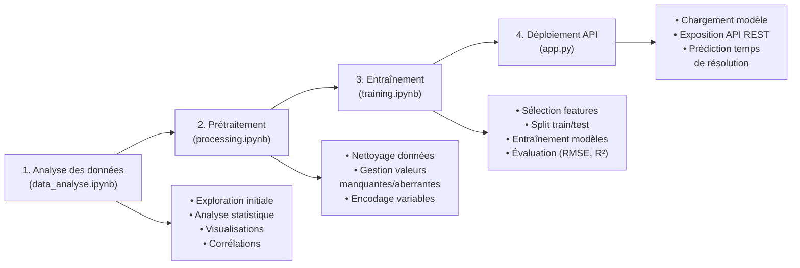

# Système de Prédiction du Temps de Résolution d'Incidents

## Aperçu général (Overview)
Ce projet est un système de prédiction du temps de résolution d'incidents basé sur un modèle d'apprentissage automatique. Il permet d'estimer le temps nécessaire (en heures) pour résoudre différents types d'incidents informatiques en fonction de plusieurs paramètres comme la priorité, la catégorie, le type d'incident, la sévérité et la date de création.
L'application est développée en Python avec Flask pour exposer une API REST qui reçoit les informations d'un incident et renvoie une estimation du temps de résolution.

## Diagramme de flux du développement du modèle
Le développement du modèle suit les étapes suivantes:



## Comment tester le projet

### Prérequis
- Python 3.8+
- Dépendances listées dans `requirements.txt`

### Installation
```bash
# Installer les dépendances
pip install -r requirements.txt
```

### Lancer l'API
Pour démarrer le serveur API Flask:

```bash
cd api
python app.py
```

Le serveur démarrera sur http://localhost:5000

### Tester l'endpoint de prédiction
Vous pouvez tester l'API en utilisant le fichier HTTP fourni:

1. Si vous utilisez VS Code avec l'extension REST Client:
   - Ouvrez le fichier `docs/resolution-time-predictor.http`
   - Cliquez sur "Send Request" au-dessus de la requête

2. Ou utilisez curl:
```bash
curl -X POST http://localhost:5000/predict \
  -H "Content-Type: application/json" \
  -d '{
    "priority": "High",
    "category": "Wireless Network",
    "issueType": "Configuration Error on Network",
    "severity": "Critical",
    "creationDate": "2025-05-19 00:20:00"
  }'
```
