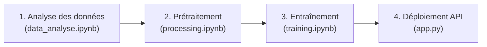

# 🧠 Prédiction du temps de résolution des tickets d’incidents

## 1. 🎯 Contexte du projet

Développer un projet de bout en bout visant à prédire automatiquement le **temps de résolution d’un ticket d'incident**.  
Ce cas d’usage s’inspire de scénarios réels dans les centres de support technique, où l’anticipation du délai de résolution permet de **mieux allouer les ressources** et améliorer le service client.

---

## 2. 🎯 Objectif

L’objectif principal est de concevoir un **modèle de régression supervisée** capable d’estimer, en heures, le temps nécessaire pour résoudre un ticket dès sa création, en se basant sur ses caractéristiques.

---

## 3. ⚙️ Étapes de développement du modèle

Le projet a été structuré en plusieurs phases, chacune documentée dans un notebook ou automatisée via script :

| Étape                                                    | Description                                                                 |
|----------------------------------------------------------|-----------------------------------------------------------------------------|
| [`data_analyse.ipynb` ](../notebooks/data_analyse.ipynb) | Analyse exploratoire : compréhension des variables, distribution, corrélations |
| [`processing.ipynb` ](../notebooks/processing.ipynb)     | Nettoyage, transformation temporelle, encodage des variables                 |
| [`training.ipynb`](../notebooks/training.ipynb)          | Entraînement de modèles de régression, évaluation des performances          |
| `app.py`                                                 | Test de prédiction via une API Flask simulant l’intégration réelle du modèle |

---

## 4. 🧩 Défis rencontrés et solutions

- **Optimisation des performances du modèle** : L’un des plus grands défis a été d’améliorer la corrélation entre les variables prédictives et la variable cible. Cela a nécessité un **travail approfondi de feature engineering**, en extrayant des attributs temporels (jour de la semaine, mois, week-end) et en testant différentes combinaisons de variables.
- **Choix du bon algorithme de régression** : Plusieurs modèles ont été testés (Ridge, Lasso, Gradient Boosting, Random Forest) avec une **optimisation d’hyperparamètres** via GridSearch pour maximiser le R² sur l’ensemble test.

---

## 5. 🧠 Compétences développées

- Maîtrise des bases de **Python**
- Utilisation de bibliothèques clés pour la science des données :
  - `pandas`, `numpy` pour la manipulation des données
  - `matplotlib`, `seaborn` pour la visualisation
  - `scikit-learn` pour la modélisation supervisée (régression, pipeline, encodage, évaluation)
- Nettoyage et transformation de données temporelles
- Création d’un pipeline de machine learning

---

## 6. ✅ Conclusions

Ce projet m'a permis de couvrir l’ensemble du cycle de vie d’un projet de machine learning :
- De la **compréhension des données** jusqu’au **déploiement d’un modèle**.
- Le modèle final atteint des performances satisfaisantes (R² > 0.70 sur les données test).
- Il est désormais **intégrable dans une application ou API** et prêt à évoluer.
